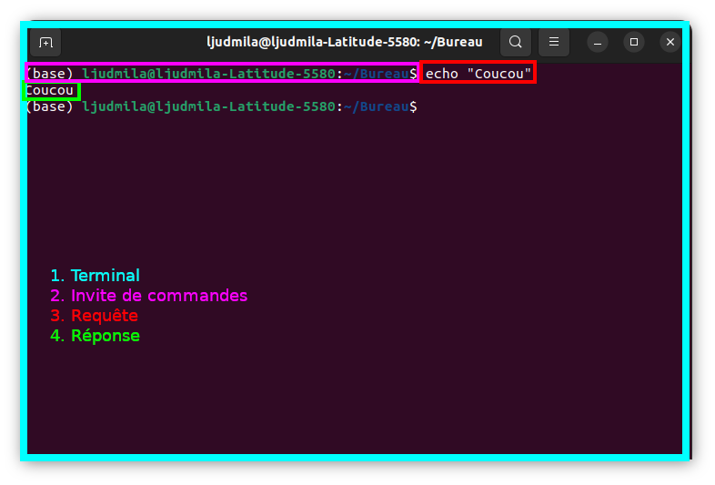

<style>
section {
  background-color: white;
  color: black;
}

h1 {
  color: DarkBlue;
}

h2 {
  color: DarkBlue;
}

h3 {
  color: DarkBlue;
}

h4 {
  color: DarkBlue;
}

h5 {
  color: DarkBlue;
}

h6 {
  color: DarkBlue;
  font-size: 30px;
  font-weight:normal;
}

blockquote {
  background: #ffedcc;
  border-left: 10px solid #d1bf9d;
  margin: 1.5em 10px;
  padding: 0.5em 10px;
}
blockquote:before{
  content: unset;
}

blockquote:after{
  content: unset;
}

small-text {
    font-size: 0.75rem;
  }

smaller-text {
    font-size: 0.5rem;
  }

</style>

<!-- _class: lead -->


 # Ligne de commande


###### Ljudmila PETKOVIC

<br>


<small-text>

Cultures numériques avancées
Mineure « Humanités numériques »
Paris, le 31 janvier 2023

<br>

<smaller-text>*Diapositives adaptées de [Simon Gabay](https://github.com/gabays/Fondamentaux/blob/main/Lignes_de_commandes/DistRead_1_2.pdf) et de [Simone Rebora](https://github.com/ABC-DH/EnExDi2022/tree/main/materials/1_KnowYourComputer/slides)*</smaller-text>


</small-text>


---

# Connaître son propre ordinateur

---

# Shell

* interface système permettant d'accéder au « cœur » ou « noyau » (*kernel*) et d'interagir avec le système d'exploitation (SE) (p. ex. Windows, Mac, Linux)
* permet d'envoyer des instructions dans un format précis, compréhensible par la machine
* langage de programmation : *shell Unix*, qui est un interpréteur de commandes
  * le plus connu est le *Bash* (*Bourne‐Again shell*) : interpréteur en ligne de commande de type script
  * on l'utilise depuis le terminal / la console (≠ applications utilisant une interface graphique)
  * la couche la plus haute des interfaces des systèmes Unix (≠ couche de bas niveau : « noyau »)

---

# Shell

La coque logicielle d'un système d'exploitation peut prendre deux formes distinctes :

* interface graphique 
  * navigateur web est un shell pour un moteur de rendu HTML 
    * Firefox est un shell pour le moteur Gecko

* **interface en ligne de commande** (plus généralement employé dans ce sens)
  * interpréteur de lignes de commandes 
  * accès aux services et interaction avec le noyau d'un SE
  * dans le cas d'Ubuntu, un shell interagit avec le noyau Linux


<small-text>Source : [Wiki ubuntu-fr](https://doc.ubuntu-fr.org/shell)</small-text>

---

# Schéma conceptuel d'un système Unix

<br>

<br>

<br>

<br>

<br>

<br>

<br>

<br>

<br>

<br>

<br>


<p align="center">Source : Gabay, S. (2022). Les lignes de commandes et Bash. Université de Genève.</p>

---

# Console

* écran (le plus souvent noir) destiné à recevoir des commandes Shell
* sous Linux, il y a 6 différentes consoles
  * `Ctrl + (Fn) + Alt + F1` : la console numéro 1 [terminal 1 (`tty1`)]
  * `Ctrl + (Fn) + Alt + F2` : la console numéro 2 [terminal 2 (`tty2`)]
    ... 

---

# Interface graphique

* angl. *graphical user interface* – *GUI*

* environnement graphique (généralement un env. de bureau ou un écran d'accueil)

* manière dont est présenté un logiciel à l'écran pour l'utilisateur

* positionnement des éléments : menus, boutons, fonctionnalités dans la fenêtre

* une GUI bien conçue est ergonomique et intuitive (facile à utiliser)

  <br><small-text>Source : [Xyoos](https://cours-informatique-gratuit.fr/dictionnaire/interface-graphique/)</small-text>

---

# Exemple de la GUI

<br><br>

<br><br>

<br><br>

<br><br>

<br>


<div align="center">Analyse du corpus de Jane Austen dans Voyant Tools.</div>

---

# Interface en ligne de commande

* angl. *command-line interface* – *CLI*

* interface homme‐machine dans laquelle la communication entre l'utilisateur et l'ordinateur s'effectue en mode texte :

  * l'utilisateur tape une ligne de commande, c'est‐à‐dire du texte au clavier pour demander à l'ordinateur d'effectuer une opération

  * l'ordinateur affiche du texte correspondant au résultat de l'exécution des commandes tapées ou à des questions qu'un logiciel pose à l'utilisateur


---

# Exemple d'utilisation de la ligne de commande

<br>

<br>

<br>

<br>

<br>

<br>

<br>

<br>

<br>

<br>



<div align="center">Terminal. Ubuntu 22.04.1 LTS.</div>

---

# Invite de commande

`ljudmila@ljudmila-Latitude-5580:~/Bureau$`

* `ljudmila` : nom d'utilisateur
* `ljudmila-Latitude-5580` : nom de l'ordinateur
* `@` : chez (angl. *at*)
* `~/Bureau` : on est parti du dossier-racine `~` et arrivé au dossier `/Bureau`
* `$` : on est connecté en tant que simple utilisateur 
  * <small-text>le cas où on sera connecté en tant que « super utilisateur » le `$` sera remplacé par `#`</small-text>

---

# Structure des répertoires

* façon dont un système d'exploitation organise les fichiers / répertoires accessibles à l'utilisateur 
* les fichiers sont généralement affichés dans une arborescence hiérarchique
* angl. *Filesystem Hierarchy Standard* : « norme de la hiérarchie des systèmes de fichiers » 
  * GNU/Linux et la plupart des systèmes Unix

---

# Structure des répertoires

<br>

<br>

<br>

<br>

<br>

<br>

<br>

<br>

<br>

<br>

<br>


*<p align="center">Filesystem Hierarchy Standard.</p>*

---

# Fonctions des répertoires

* `/bin/` : commandes de base nécessaires au démarrage et à l'utilisation d'un système minimaliste
* `/etc/` : *editable text configurations* ou fichiers de configuration
* `/lib/` : bibliothèques (*librairies*) logicielles nécessaires pour les exécutables
* `/home/` : répertoire des utilisateurs
* ...

Les répertoires de chaque utilisateur sont eux connus (fichiers de système cachés)

* `Bureau`
* `Documents`
* `Téléchargements`
* ...

---

# `root`

Les répertoires sont organisés comme un arbre : 


<br>

<br>

<br>

<br>

<br>

<br>

<br>

<br>

<br>

* le premier répertoire (ici `Ordinateur`) est appelé le répertoire *racine* (`root`) 
* il contient tous les autres, organisés comme des branches partant de ce tronc

---

# Chemin absolu

L'adresse du répertoire racine est `/`. Celle d'un répertoire ou d'un fichier précis est ainsi la liste des répertoires depuis `root` pour accéder à celui voulu, chaque nom étant séparé avec un `/`. Ainsi, pour atteindre le fichier `bash` dans le dossier `bin` , je suis le chemin **absolu** : `/bin/bash`.

# Chemin relatif

Le chemin que nous venons de voir est dit *absolu*, car il part de l'élément racine, mais il existe aussi des chemins **relatifs** si nous partons d'un autre endroit (normalement celui où nous sommes déjà) : `ljudmila/home/bin/bash`.

---

# Chemin relatif

Parfois il est impossible de savoir quel est le nom du fichier précédent dans l'arborescence, il est possible d'utiliser un raccourci : `..` signifie ainsi « remonter d'un dossier » :

```bash
ljudmila/home/bin/bash
```

est ainsi l'équivalent de

```bash
ljudmila/../bin/bash
```

---

# Conventions de nommage

1. Il est fortement déconseillé d'utiliser des espaces
2. Des stratégies alternatives existent comme:
2.1 Le camelCase (par exemple : `nomDeFichier.extension`)
2.2 Avoir recours à des tirets (`nom-de-Fichier.extension`) ou
des tirets bas (`nom_de_Fichier.extension`)
2.3 Tentez d'être cohérent dans cette stratégie
3. Versionnez les documents (`nom-de-Fichier-v1.extension`) ou
datez‐les en commençant par l'année (`nom-de-Fichier-AAA-MM-JJ.extension`)
4. L'extension doit être choisie avec attention : un `.txt` n'est pas un `.xml`

---

# Utiliser la ligne de commande

---

# Téléchargement du dépôt GitHub

>  Pour le tout premier cours, télécharger le [dépôt GitHub](https://github.com/ljpetkovic/L2HN001), en cliquant sur `Code > Download ZIP` (plus tard, nous allons apprendre comment *cloner* un dépôt et manipuler ses fichiers et ses répertoires)

---

# Ouvrir le terminal

Pour Linux Ubuntu 

* taper `Ctrl + Alt + T` ou `terminal` dans le champ de recherche

Pour Windows 

* installer Microsoft Power Shell (télécharger le package `.zip` puis installer Power Shell → [tutoriel](https://learn.microsoft.com/en-us/powershell/scripting/install/installing-powershell-on-windows?view=powershell-7.3))

Pour Mac

* taper `terminal` dans le champ de recherche (`Terminal.app`  dans `Applications` > `Utilitaires`)

---

# Première commande

Ouvrez le terminal, et tapez `pwd`. Que se passe-t-il ?

---

# `pwd`

Montrer où nous sommes dans le système des fichiers et des répertoires.

(angl. *print working directory*)

---

# Fonctionnement

* Bash exécute les instructions ligne par ligne : la fin de ligne est la fin
  de commande
* une commande doit être complète, sinon elle ne s'execute pas
* une commande est appelée par son nom (par exemple `pwd`), qui permet de retrouver la fonction, le *builtin*, le programme associé
  * une fonction est un bloc de commandes qui s'exécute lorsque la fonction est appelée
  * un *builtin* (« préconstruit », comprendre « prédéfini ») est une mini‐opération pré‐construite en bash (dont `pwd`)
  * un programme est un groupe d'instructions

---

# Localisation

Certaines commandes prédéfinies sont enregistrées dans la machine (comme `pwd` ou `ls`) : leur nom suffit pour les appeler.

```bash
pwd
```

```bash
ls
```

Dans d'autres cas, comme celui de scripts ou de programmes, il faut spécifier le chemin ou le fichier se trouve. Pour cela on utilise le chemin absolu ou (ici) relatif :

```bash
commandes/commande_1.sh
```

* Devinez le contenu du fichier

---

# Affichage des fichiers / répertoires

`ls` : lister les noms des fichiers et des répertoires *visibles* dans le répertoire courant

`ls -l` : utiliser un format de liste longue (avec les indications des permissions pour chaque fichier)

---

# Argument

Certaines commandes vont nécessiter des précisions : copier *ceci*, aller *là‐bas*. Pour donner ces précisions, on va ajouter à la commande des arguments.

Prenons l'exemple de la commande `cd` (*change directory*) qui permet de se déplacer. On pourrait la traduire par `« aller à » [commande] + lieu [argument]`. Le lieu où l'on se dirige prend la forme du répertoire‐destination placé juste après la commande :

```bash
cd commandes
```

---

# Changer le répertoire

```bash
cd Documents # aller dans le répertoire 'Documents'
```

```bash
cd ../.. # remonter de deux dossiers
```

```bash
cd . # rester dans le même répertoire
```

* Retrouvez le fichier `commande_1.sh`

---

# Astuces pour naviguer dans le système des fichiers

* Faire glisser des éléments dans une fenêtre Terminal afin d’entrer le chemin absolu d’un fichier / répertoire
  
* Ouvrir le terminal à partir du répertoire souhaité
  * clique droite sur le répertoire > `Ouvrir dans un terminal`

* Flèche haut `↑` et bas `↓` pour se déplacer dans l'historique du terminal

* Tabulation (`↹`) pour l'auto-complétion

---

# Exercice

* naviguez jusqu'au répertoire `Documents` 

* exécutez la commande suivante :

  ```bash
  help
  ```

* tentez de comprendre ce qu'il s'est passé

---

# Arguments

Parfois on peut avoir besoin de plusieurs arguments. On les ajoute ainsi les uns après les autres.

* commande `cp` (*copy*), que l'on peut traduire par `« copier » [commande] + tel chose [argument 1] + à tel endroit [argument 2]` :

  ```bash
  cp commandes/test.sh ..
  ```

* commande `rm` (*remove*) qui permet d'effacer un fichier :

  ```bash
  rm test.sh
  ```

---

# Options

On peut ajouter des options, qui vont modifier le comportement normal d'une commande. Elles sont placées après la commande et son précédées d'un tiret (`-`).

`ls -a` : lister les noms des fichiers et des répertoires *cachés* dans le répertoire courant

<small-text>Fichiers commençant par un point, p. ex. `.fichier_cache.txt`</small-text>
<small-text>Raccourci pour afficher les fichiers cachés : `Ctrl + H` (Linux)</small-text>

`ls --help` : expliquer comment utiliser la commande `ls` et quelles options elle accepte 

---

# Commandes de base

---

# Lecture

Vous pouvez regarder ce que contient un fichier avec la commande `less` (visualiseur de fichier texte en ligne de commande) :

```bash
less commandes/commande_1.sh
```

<small-text>(pour quitter tapez `:q`)</small-text>

Il existe de multiples éditeurs pour le terminal :

* `nano` + FICHIER (pour quitter, tapez `ctrl+X`)
* `vim` + FICHIER (pour quitter, tapez `:q`)

Vous pouvez examiner le type du fichier avec la commande `file` :

```bash
file commandes/commande_1.sh
```

---

# Aide

La commande `man` (avec en argument le nom de la commande) permet d'afficher le manuel de la commande :

```bash
man ls
```

La commande `compgen -c` permet d'afficher toutes les commandes disponibles (`compgen -a` tous les *alias*) :

```bash
compgen -c
```

<small-text>Un alias vous permet de créer un nom de raccourci pour une commande, un nom de fichier ou un texte de shell.</small-text>

---

# Créer un script

La commande `touch` permet de créer un fichier :

```bash
touch mon_script.sh
```

Tentons de créer notre premier script bash avec la commande `nano mon_script.sh`.

Petite astuce : on déclare normalement le type de document avec un appel de script (ou *Shebang*) indiquant que le fichier n'est pas un fichier binaire mais un script :

```bash
#!/bin/bash
ls
```

---

# Exécution du script

Ce script permet d'exécuter la commande `ls`. Il est exécuté de manière suivante :

```bash
bash mon_script.sh
```

ou 

```bash
./mon_script.sh
```

<small-text>Si vous obtenez un message d'erreur : `bash: ./mon_script.sh: Permission non accordée`, il faut donner au fichier la permission d'exécution (le rendre exécutable) `chmod +x mon_script.sh`</small-text>

---

# Copier le fichier

La commande `mkdir` (*make directory*) permet de créer un répertoire :

```bash
mkdir test
```

La commande `cp` (*copy*) permet de copier un fichier :

```bash
cp mon_script.sh test
```

Déplacer une multitude de fichiers en les mettant à la suite :

```bash
cp FICHIER_1 FICHIER_2 RÉPERTOIRE_CIBLE
```

Copier un fichier dans le même répertoire en lui attribuant un nouveau nom :

```bash
cp test/mon_script.sh test/mon_script_2.sh
```

---

# Déplacer le fichier

Un alternative à la commande `cp` est la commande commande `mv` (*move*), qui permet de déplacer (et non copier) un fichier :

```bash
mv mon_script.sh test
```

Son fonctionnement est proche de `cp` :

```bash
mv FICHIER_1 FICHIER_2 RÉPERTOIRE_CIBLE
```

Si tous les fichiers ont la même extension, il est possible d'utiliser un joker (`*`) :

```bash
mv *.sh RÉPERTOIRE_CIBLE
```

---

# Effacer

La commande `rm` (*remove*) permet d'effacer un fichier, avec l'option `-f` pour forcer l'exécution si besoin :

```bash
rm mon_script.sh
```

Pour effacer un répertoire contenant des fichiers, il faut utiliser :

* l'option `-r` (*recursively*) qui permet d'effacer tous les fichiers contenus l'un après l'autre
* l'option `-f` (*force*) pour éviter d'avoir à valider pour chaque fichier

```bash
rm -rf test
```

---

# Rechercher

Il est possible de faire des recherches dans un fichier en utilisant la fonction `grep` :

```bash
grep "ordinateur" fichier_test.txt
```

Nous pouvons faire des requêtes en utilisant les expressions régulières (*regex*).

Trouvons tous les mots commençant par la lettre « m », en majuscule ou en minuscule.

```bash
grep -Eoi "\bm\w+" fichier_test.txt
```

<smaller-text>`-E` : expression rationnelle étendue (≠ expression rationnelle simple `-G`)
<smaller-text>`-o` : n'afficher que l'occurrence en question (*match*)</smaller-text>
<smaller-text>`-i` : trouver le mot en majuscule ou en minuscule</smaller-text>
<smaller-text>`\b` : limite de mot, c'est-à-dire le début d'un mot<smaller-text>
<smaller-text>`\w+` : un ou plusieurs caractères alphabétiques<smaller-text>

---

# Premier script - exercice guidé

`echo`

La commande echo permet d'afficher un message :

```bash
echo "Coucou René"
```

Comment remplacer *René* par le nom d'une personne ?

---

# Première étape

1. Créer le fichier `coucou.sh` avec la commande `touch`
2. Ouvrez‐le avec la commande `nano`
3. Ajoutez le *shebang* et la commande `echo` suivi de `Coucou`
   * <small-text>Pour quitter : `Ctrl + X` 
   * <small-text>Sauver l'espace modifié ? `O` (oui)</small-text>
   * <small-text>Nom du fichier à écrire: `coucou.sh`</small-text>

---

# Créer une variable

Dans la séquence *Coucou* + *nom* si *nom* doit pouvoir changer il s'agit d'une variable. Cette dernière est stockée sous un nom arbitraire :

```bash
nom="Michel" # ne pas séparer la variable du signe « égal à » (nom = "Michel")
```

et appelée avec son nom précédée de `$` :

```bash
echo "Coucou $nom"
```

Solution : `solution_coucou.sh`

---

# Saisir la variable

L'idéal serait cependant de demander à l'utilisateur de saisir lui‐même son nom. Pour cela nous avons la commande `read` qui permet de rentrer du texte dans le script.

Il suffit donc de remplacer la ligne appelant la variable avec la commande suivante :

```bash
read nom
```

lancez le script : que se passe-t-il ?

Solution : `solution_coucou_2.sh`

---

# Améliorer la saisie de la variable

Il n'est pas évident de savoir qu'il faut rentrer son nom, alors que l'ordinateur nous demande rien... L'idéal serait d'afficher un message spécifiant les attendus.

Pour cela nous allons utiliser l'option `-p` pour prompt suivi du message, puis du nom de la variable :

```bash
read -p "QUESTION" VARIABLE
```

Solution : `solution_coucou_3.sh`

---

# Avantages de l'utilisation de la ligne de commande

* **Flexibilité** : combiner les commandes et obtenir une palette pratiquement infinie de fonctions nouvelles
* **Fiabilité** : tendance à s'exécuter de la même manière sur différents SE (« couteau suisse »)
* **Rapidité** : automatisation des tâches à grande échelle (p. ex. renommer un ensemble des fichiers d'un seul coup)
* **Expérience** : communiquer avec votre ordinateur plus directement qu'avec les programmes graphiques, en apprenant ainsi énormément sur son fonctionnement interne
* **Économisation des ressources** : utilise les ressources de l'ordinateur beaucoup plus parcimonieusement que les programmes graphiques

<small-text>Source : [Floss Manuals](https://fr.flossmanuals.net/introduction-a-la-ligne-de-commande/introduction/)</small-text>
