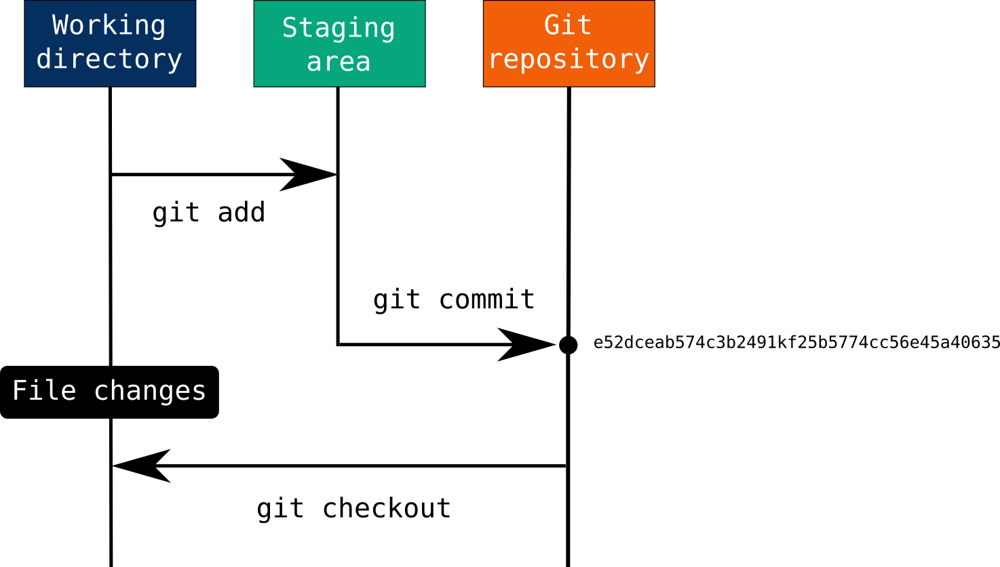

<style>
section {
  background-color: white;
  color: black;
}


h1 {
  color: DarkBlue;
}

h2 {
  color: DarkBlue;
}

h3 {
  color: DarkBlue;
}

h4 {
  color: DarkBlue;
}

h5 {
  color: DarkBlue;
}

h6 {
  color: DarkBlue;
  font-size: 30px;
  font-weight:normal;
}

blockquote {
  background: #ffedcc;
  border-left: 10px solid #d1bf9d;
  margin: 1.5em 10px;
  padding: 0.5em 10px;
}
blockquote:before{
  content: unset;
}

blockquote:after{
  content: unset;
}

small-text {
    font-size: 0.75rem;
  }

smaller-text {
    font-size: 0.5rem;
  }

</style>

<!-- _class: lead -->


 # Git


###### Ljudmila PETKOVIC

<br>


<small-text>

Cultures numériques avancées
Mineure « Humanités numériques »
Paris, le 21 mars 2023

<br>

<smaller-text>*Diapositives adaptées de l'[IUT Lyon 1](https://perso.liris.cnrs.fr/pierre-antoine.champin/enseignement/intro-git/)* *et de [Thibault Clérice](https://github.com/PonteIneptique/cours-git)*</smaller-text>


</small-text>

---

# Partie théorique

---

# Problème 1

<p align="center">
  
</p>

* la version la plus à jour est-elle `Rapport.doc` ou `Rapport_VFinale.doc` ?
* et si on avait aussi `Rapport_VFinale1.doc` et `Rapport_VFinale2.doc` ?
* les versions n’apparaissent pas dans l’ordre (`1.1`, `1`, `2`)
* la version `2-jd` vient elle avant ou après la version `2` ?

---

# Problème 1.1

<p align="center">
  
</p>

* les versions de l’image sont-elles numérotées indépendamment, ou par rapport aux versions de la page ?
* nécessité de renommer les fichiers pour visualiser une ancienne version (pour que les liens fonctionnent)

---

# Besoins des utilisateur·trice·s

Les utilisateur·trice·s ont donc besoin de :

- Comprendre les versions
- Pouvoir revenir en arrière, avoir une « trace » des documents
- Pouvoir avoir une collaboration simple

---

# Gestion des versions

- La gestion des versions est un travail fastidieux et méthodique.
- Les humains ne sont pas doués pour les travaux fastidieux et méthodiques.
- Laissons cela à l’ordinateur,
  - et concentrons-nous sur la partie du travail où nous sommes meilleurs que l’ordinateur.

→ VCS (*Version Control System*)

---

<p align="right">
  
</p>

# Git : un outil de versionnage 

- Créé en 2005 par le créateur du noyau Linux Linus Torvalds et par Junio Hamano
- Initialement dédié à la gestion de code source pour les projets logiciels +
  - documentation
  - site web
- travail collaboratif 
  - facilité d’échange
  - traçabilité
  - gestion des conflits

---

# Dépôt

- (angl. *repository*, abbr. *repo*) Dossier dans lequel nous travaillons
- Il contient un répertoire (souvent caché) **`.git`** qui contient toutes les données dont GIT a besoin pour gérer l’historique

---

# *Commit*

Pour qu'une modification soit archivée, il faut que cela soit explicité (≠ Dropbox, Google Drive ou systèmes de stockages similaires)

* Ces modifications archivées sont appelées *commit*

- Elles portent un message enregistré par l'utilisateur
- Elles peuvent comporter plusieurs fichiers
- Les fichiers qui ont subi des modifications doivent y être ajoutés explicitement

---

# *Commit*

L’historique d’un projet est une séquence de « photos » (commits), contenant l’état de tous les fichiers du projet.

Les commits possèdent :

- une date
- un auteur
- une description textuelle
- un lien vers le(s) commit(s) précédent(s)

On parle également de **révision**.

---

# *Commit* 

<p align="center">
  
</p>

---

# Trois états de fichiers 

1. ***modified*** : le fichier a subi des modifications, mais nous ne l'avons pas encore ajouté (`add`) à un futur commit
2. ***staged*** : le fichier a été ajouté (`add`) à un commit, mais le commit n'a pas été finalisé avec un message → *staging area*, *stage* ou *index*
3. ***committed*** : le fichier a subi des modifications enregistrées (archivées) et n'a pas été modifié depuis lors

<p align="right">
  
</p>

---

# Remarque

Bien que *conceptuellement*, chaque commit contient tous les fichiers du projet, GIT utilise un système de stockage très efficace :

- le commit ne stocke que les fichiers modifiés par rapport au commit précédent
- l’ensemble peut être compressé (`git gc`) pour réduire encore la redondance (lorsque deux versions successives d’un fichier sont très proches)

NB : bien que GIT (et les autres VCS) soient plus particulièrement conçus pour des fichiers texte, ils fonctionnent aussi avec des fichiers binaires (images, bureautique, etc.).

---

# Commandes principales

- **Initialisation** : `git init`
- **Ajout de modifications** : `git add [Nom du fichier]` ou `git add -A` (Ajout de tous les fichiers changés)
- **État du dépôt** : `git status` (donne la liste des modifications réalisées)
- **Enregistrement de modifications** : `git commit -m "Message du commit"`. N'oubliez jamais le `-m` à moins de vouloir passer un mauvais moment.
- **Historique du repository** : `git log`
- **Différence entre l'état archivé et l'état actuel** : `git diff` pour une différence détaillée, `git status` pour un point général.
- **Publier les commits** : `git push`

---

# Les avantages de la gestion de versions

- Sauvegarde et synchronisation avec un serveur distant
- Conservation de l’historique (nominatif) des fichiers (qui a fait quoi ?)
- Possibilité de retour en arrière
- Fusion des modifications lors du travail collaboratif
- Visualiser les changements au cours du temps

---

# Partie pratique

---

# Installation du Git

Tutoriels :

* [Mac OS X](https://www.atlassian.com/git/tutorials/install-git#mac-os-x)
* [Windows](https://www.atlassian.com/git/tutorials/install-git#windows)
* [Linux](https://www.atlassian.com/git/tutorials/install-git#linux)

---

# Sur Mac OS X

### Git for Mac Installer

1. Télécharger la version la plus récente du [Git for Mac installer](https://sourceforge.net/projects/git-osx-installer/files/).

2. Suivre les instructions d'installations.

3. Ouvrir le terminal et vérifier si l'installation a réussi en tapant `git --version` :

   <p align="center">
     
   </p>

4. Configurer votre nom d'utilisateur Git, ainsi que votre email en utilisant les commandes suivantes, en remplaçant `"Emma Paris"` par votre nom, et `"eparis@atlassian.com"` par votre email. Ces détails seront associés aux commits que vous créez :

```js
$ git config --global user.name "Emma Paris"
$ git config --global user.email "eparis@atlassian.com"
```

\5. (Optional) To make Git remember your username and password when working with HTTPS repositories, [configure the git-credential-osxkeychain helper](https://www.atlassian.com/git/tutorials/install-git#install-the-git-credential-osx).

---

# Exercice

* naviguez jusqu'au répertoire `Documents` 

* exécutez la commande suivante :

  ```bash
  git clone https://github.com/ljpetkovic/L2HN001.git
  ```

* tentez de comprendre ce qu'il s'est passé
* placez‐vous dans le répertoire que vous venez de télécharger

---

